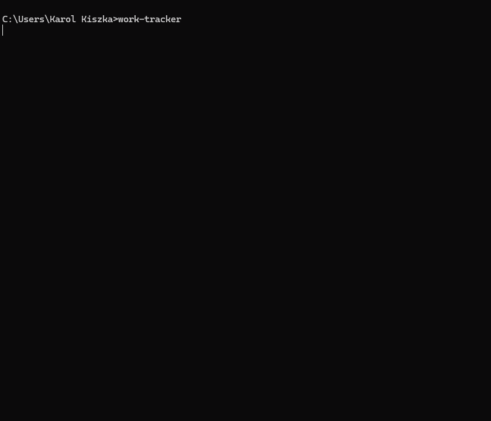
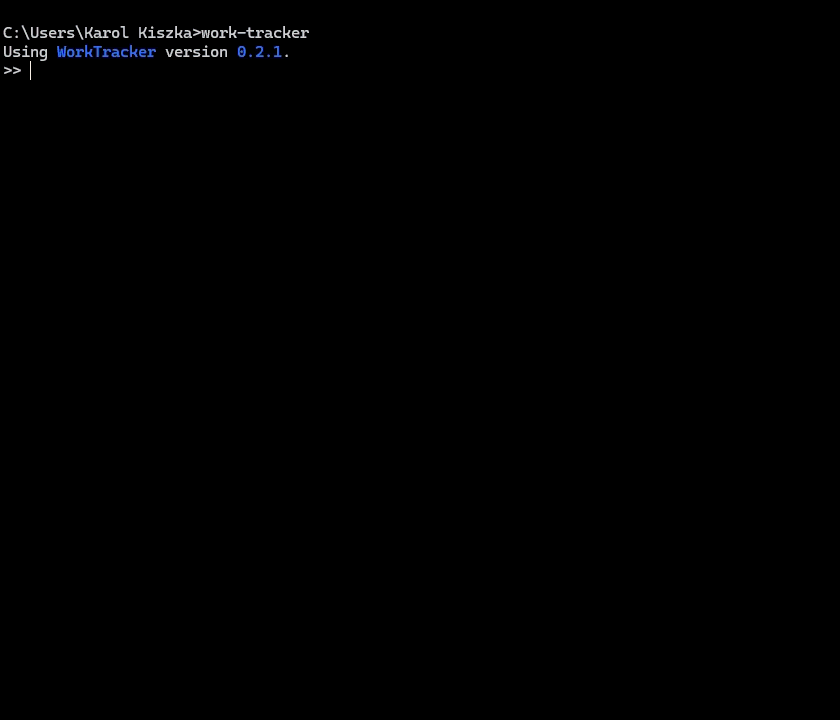

# WorkTracker


[](https://wakatime.com/badge/user/92cf3ac1-102d-4d79-b9a8-c960cf206839/project/8c8f1653-1d14-4d7e-90bc-01591ea36159 "Total time spent coding")

**WorkTracker** is a terminal-based work time tracking tool. It lets you log daily work hours, manage your schedule across remote and office days, visualise your month in a colour-coded calendar, and calculate how much time you still need to reach your monthly target - all from a relatively simple to use interactive command-line interface.

> **Note:** This library is still in early development and may contain bugs, but with each update it will become more stable.





## Installation

Requires Python 3.10 or newer.

```bash
pip install work-tracker
```

## Starting the app

```bash
work-tracker
```

On the first launch you will be asked for your **country code** (e.g. `PL`, `DE`, `US`). WorkTracker uses it to automatically populate public holidays so those days are not counted as workdays.

Pass `-suc` / `--skip-update-check` to skip the PyPI update check at startup:

```bash
work-tracker --skip-update-check
```

## How it works

WorkTracker is an interactive REPL. Once started, you type commands at the prompt (`>>`). The prompt changes to reflect the **active date context**:

| Prompt | Active context |
|---|---|
| `>> ` | Today (default) |
| `[DD.MM]>> ` | A specific day |
| `[DD.MM.YYYY]>> ` | A specific day in a past/future year |
| `[mon]>> ` | A specific month |

**Switching context** - type a date to change the active context:

```
11.             # switch to 11th day of the current month
24.05           # switch to 24 May of the current year
.05.            # switch to month view for May of the current year
jan             # switch to January (month view)
24.05.2024      # switch to a specific day in 2024
```

**Chaining commands** - use `&&` to run multiple commands in one line:

```
status && calendar
```

**Date-prefixed commands** - prefix any command with a date to run it for that date without switching context:

```
24.02 status
(01. 15.05 22.05.2026) remote
```

**Recording time** - type a time value directly to log it for the currently active day:

```
8:30            # set time worked to 8 h 30 min
+30             # add 30 minutes
-1h             # subtract 1 hour
2h15m           # set to 2 hours 15 minutes
```

**Command abbreviation** - every command can be shortened to the minimal unambiguous prefix:

```
tu              # runs tutorial
st              # runs status
cal             # runs calendar
```

Data is automatically saved on `exit` and on `Ctrl+C`. A crash log and an emergency save are written if the app exits unexpectedly.

## Commands

WorkTracker comes with a wide set of built-in commands covering time tracking, schedule management, planning, data management, and customisation.

To see all available commands, run:

```
help
```

For detailed usage of any specific command, including all supported argument combinations and which modes it works in run:

```
help <command>
```



The built-in `tutorial` command is also a good starting point if you are using WorkTracker for the first time.

## Macros, aliases & keywords

One of WorkTracker's most powerful features is its scripting layer, which lets you extend the command language to fit your own workflow.

**Aliases** are plain text substitutions applied before parsing. Whenever WorkTracker sees an alias anywhere in your input it replaces it with the defined text before executing the command. They are great for shortening things you type often:

```
alias fo "8h && office"             # fo now expands to: 8h && office
alias hw "4h && remote && status"   # hw now means: 4 hours of remote work and then print the summary
```

**Macros** go further - they are named, reusable command sequences that support optional and required arguments. A macro runs like any other command, and the date you prefix it with is passed down to every command inside it:

```
macro log <type=remote> "<type> && status"
24.05 log office              # marks 24 May as office and prints its status
```

**Keywords** are special `$`-prefixed (prefix is configurable) values that resolve to dates at runtime, so you never have to type today's or yesterday's date manually:

```
$yesterday status             # show status for yesterday
$nextmonth calendar           # show calendar for next month
$yesterday remote             # mark yesterday as remote work
```

All three features compose freely. Aliases expand before anything else, so they can be used inside macro definitions. Keywords resolve at runtime, so they work as date arguments both in direct input and inside macros - for example, a macro that always operates on yesterday's date without you having to specify it. This lets you build up a small personal vocabulary of shortcuts tailored exactly to how you work.

Run `keyword` to see all available keywords, `alias` / `macro` to list what you have defined, and `help alias` / `help macro` for the full syntax reference.

## Configuration

The configuration file (`config.yaml`) and all data files are stored in the OS user-data directory. Run `files` inside the app to find the exact path.

Common settings you may want to change:

- `command.fte.default_value` - default FTE for new months (default: `1.0`)
- `command.rwr.default_value` - default remote work ratio (default: `0.4`)
- `command.undo_history_size` - number of undoable actions kept in memory (default: `50`)
- `output.max_width` - maximum output width in characters (default: `80`)

Use the `config` command to inspect and change any setting without editing the file directly:

```
config output.max_width 100
```

## License

MIT &mdash; see [LICENSE](LICENSE).
